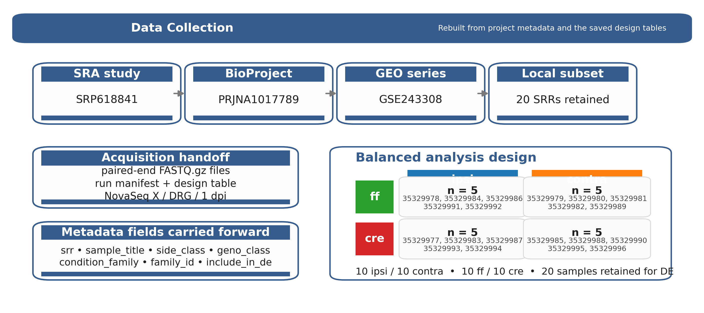
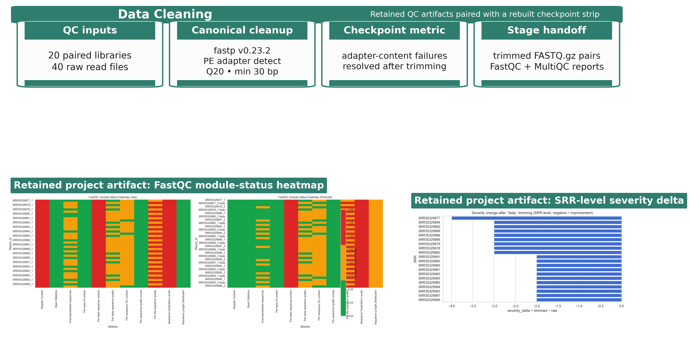
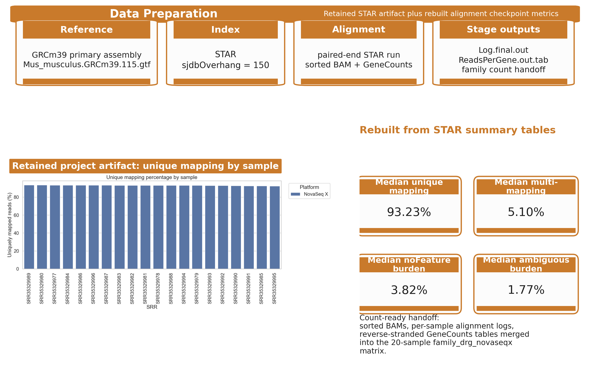
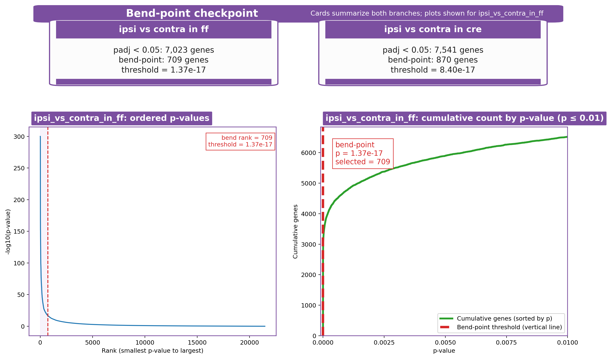

# Requirements

Part of a draft, written by the group, is due during Weeks 13 through 15 on the following schedule. Drafts must be submitted to the appropriate myCourses DropBox before Thursday workshop. Each draft is worth 1% of your final grade, for a total of 3%. No late drafts will be accepted for a grade. For drafts, color your individual text in a color unique to you among your group. You must use MS Word, LibreOffice, or OpenOffice. Word is available from the COS computer labs and the others are free. Be sure to include one comment at the start of the draft with your full name so that your revision color can be identified.

Week 13 \- Outline of the paper.  
Week 14 \- Draft of half of the text.  
Week 15 \- Draft of the rest of the paper.

Expectations of the paper are as follows.  
30-50 pages

- Minimum of 15 primary sources.  
- No more than half figures/tables. The rest must be prose.  
- 8.5" x 11" paper-size  
- double-spaced  
- Citations do not count for or against the page requirements.  
- MS Word 2016 or later, LibreOffice, or OpenOffice. Do not use Google Docs which creates formatting issues.  
- 10 or 12 point Calibri or Times New Roman font.  
- Exactly 1" margins.  
- No more than one page of direct quotes in total.  
- Proper spelling, grammar, and style.  
- Standard scientific sections (Introduction, Materials and Methods, Results, Discussion, References).

**Notes (draft1 formatting)**

* One clear header per section.  
* Use consistent bullet styles.  
* Use numbered lists only when order matters.  
* Leave white space for quick scanning and edits.

# Outline

**Introduction**

* Brief intro about high-throughput sequencing  
* What our goal was: utilizing NGS  
* Introduce paper/dataset   
  * Discussing methods  
    * Experimental design  
  * Goals of the paper   
    * Why did they analyze DRG with cKO  
      * Ipsilateral vs contralateral  
  * Citations (LINK)  
* How we wanted to use the paper  
* Claim  
  * “Next Gen. Seq. helps us understand what actual genes are at play beyond the ones the paper discussed”

**Materials and Methods**

* Figure of the pipeline  
  * Compared to a general NGS pipeline  
    *   
* Pipeline Steps  
  * Aggregation/Collection  
    * Download SRR (file type gz)   
      * Tool:   
  * Processing/Cleaning  
    * Raw FASTQC/MultiQC  
    * FASTP (trimming)  
    * Trimmed FASTQC/MultiQC  
  * Alignment  
    * Selection of the Genome   
      * (mm39)  
    * Building STAR Genome  
    * Align one paired-end  
  * Analysis/Interpretation  
    * MultiQC  
    * Differential Expression Analysis  
      * DESeq2  
        * Volcano Plot  
        * Heatmap of Top DEGs (Regeneration-Enhancing)  
        * MA plot  
        * Target Validation (Gene Expression Boxplots)  
    * GO Analysis  
    * Extra analysis? 

**Results**

* Quality control  
* Alignment stats  
* Differential Expression Plots (Discuss biological interpretation)  
  * PCA (VERY IMPORTANT)  
  * Volcano Plot (Important Genes)  
    * Cumulative Distribution Plot (2nd derivative is 0\)  
    * Do a secondary Volcano Plot  
  * Heatmap  
  * MA Plot  
* GO Analysis  
  * Pathway level analysis   
* \*Extra analysis once determined\*

  * # Two-hybrid screening

**Discussion \~** Discuss the biological interpretation more

* What does the data show  
  * Gene expression  
  * Injury vs control  
  * Pathways being affected  
    * proteostasis (AhR activation),   
    * translation (suppression/upregulation of genes)   
    * metabolism (energy output)  
    *   
* Things that were weird about the dataset to consider  
  * Reference Odd volcano plots  
  * The genotype is weaker / secondary  
  * collisions in PCA  
  * interpretation vs causation  
* Global Discovery  
  * External Application  
* Discussion about NGS in the context of this paper  
  * Reproducibilty  
  * Global Discovery  
* External Applications/Biological Relevance  
  * How does our Global discovery (new genes connect to the gene found in the paper)

    * # Two-hybrid screening

  * What this adds beyond the paper  
  * What it suggests for future validation

**References**

* [Main Paper](https://www.nature.com/articles/s41586-026-10295-z#code-availability)   
* NGSTech overview (paper for my courses)  
* ADD papers that use/review NGS   
* More papers referencing the background of the mouse study

**Code Availability**  
Attach git, notebook

**Source Data**  
Data supporting the graphs/ plots (actual csv)  
Dataframes…

**Supplemental Material**  
All figures

# Outline draft1

# **Draft1 outline**

## **Claim**

* \[1 sentence\] Our central point for SRP618841/mouse\_new (kept plain \+ precise)

## **Strongest evidence (draft1)**

* DE contrasts run: ipsi\_vs\_contra\_in\_ff, ipsi\_vs\_contra\_in\_cre  
* Table: filters \+ full gene lists  
* What we show (draft1 figures):  
  * QC/alignment summary  
  * PCA of samples (use sample codes to avoid clutter)  
  * Volcano/top genes for each contrast

## **Supporting/secondary evidence**

* Sample QC: read depth \+ alignment (only key metrics)  
* PCA: interpret what separates samples (cohort/condition)  
* DE table: effect sizes \+ multiple testing (state thresholds)

## **Project-specific checklist (SRP618841)**

* Read in files  
* QC  
* Alignment  
* Filtering  
* PCA  
* DE  
* One list of genes

## **Key TODOs before draft2**

* Replace placeholders with the exact claim \+ key genes  
* Add code refs to mouse\_group\_project\_work/docs  
* Decide which figures become Figure

Draft 1 mind map (ASCII)Draft 1 mind map (ASCII)

Claim

├─ Strongest evidence  
│ ├─ contrast ipsi\_vs\_contra\_in\_ff  
│ │ ├─ QC \+ alignment (only key metrics)  
│ │ ├─ PCA: cohort/condition separation (what separates)  
│ │ └─ DE: effect sizes \+ multiple testing (state thresholds)  
│ └─ contrast ipsi\_vs\_contra\_in\_cre  
│ ├─ QC/PCA/DE (same key metrics)  
│ └─ replicate pattern from ff  
├─ Supporting/secondary evidence  
│ ├─ sample QC summary  
│ ├─ PCA interpretation  
│ └─ DE table (effect sizes)  
└─ Project-specific checklist (SRP618841)  
 ├─ read in files  
 ├─ QC / alignment / filtering  
 ├─ PCA / DE  
 └─ one list of genes 

References

* Strategy doc (public): [https://github.com/pzg8794/mouse\_group\_project\_work/blob/main/docs/PAPER\_DRAFTING\_STRATEGY\_SRP618841.md](https://github.com/pzg8794/mouse_group_project_work/blob/main/docs/PAPER_DRAFTING_STRATEGY_SRP618841.md)

Draft 1 mind map (bullet version)

* Claim  
  * Strongest evidence  
    * contrast ipsi\_vs\_contra\_in\_ff  
      * QC \+ alignment  
      * PCA separation  
      * DE: effect sizes \+ thresholds  
    * contrast ipsi\_vs\_contra\_in\_cre  
      * QC/PCA/DE replication  
  * Supporting/secondary evidence  
    * sample QC summary  
    * PCA interpretation  
    * DE table  
  * Project-specific checklist (SRP618841)  
    * read in files  
    * QC / alignment / filtering  
    * PCA / DE  
    * one list of genes

**Results**

* Quality control  
* Alignment stats  
* Differential Expression Plots (Discuss biological interpretation)  
  * PCA (VERY IMPORTANT)  
  * Volcano Plot (Important Genes)  
    * Elbow (2nd derivative is 0\)  
  * Heatmap  
  * MA Plot  
* GO Analysis  
  * Pathway level analysis   
* \*Extra analysis once determined\*

Best discussion structure

* What the data show  
  * PCA: injury-side vs contralateral separation  
  * DE: side-specific contrasts are strongest  
  * key genes driving the split  
  * pathway themes supported by GO  
* What it may mean biologically  
  * injury response  
  * stress / proteostasis / translation / metabolism  
  * relation to source paper biology  
* Caveats / weird features  
  * odd volcano bias  
  * genotype is weaker / secondary  
  * collisions in PCA  
  * interpretation vs causation  
* Broader significance  
  * what this adds beyond the paper  
  * what it suggests for future validation

# Paper

Nikhi Boggavarapu  
Sam Kopelev  
Piter Garcia

## Introduction

_(Draft owner: Nikhi/Sam — placeholder for now.)_

## Materials and Methods (Piter Garcia)

Draft owner: Piter Garcia. Canonical formatting lives in `materials_methods_piter_draft.tex` (this Markdown mirrors the same subsections, figures, and tables).

This project reanalyzed mouse DRG bulk RNA-seq after spinal cord injury using four stages: **Data Collection**, **Data Cleaning**, **Data Preparation**, and **Data Analysis and Interpretation**. The working subset comprised 20 NovaSeq X paired-end libraries from `SRP618841` (BioProject `PRJNA1017789`; GEO `GSE243308`) organized into a balanced side-by-genotype design before QC, alignment, and DE modeling began.

**Table: Pipeline checkpoint table used to anchor the Methods section to stage-specific evidence.**

<table>
  <colgroup>
    <col style="width: 20%;" />
    <col style="width: 20%;" />
    <col style="width: 20%;" />
    <col style="width: 20%;" />
    <col style="width: 20%;" />
  </colgroup>
  <thead>
    <tr>
      <th>Stage</th>
      <th>Primary artifacts</th>
      <th>Core tools</th>
      <th>Checkpoint metric</th>
      <th>Handoff</th>
    </tr>
  </thead>
  <tbody>
    <tr>
      <td><strong>Collection</strong></td>
      <td>sample table; family sheet</td>
      <td><code>prefetch</code> + <code>fasterq-dump</code></td>
      <td>20 SRRs retained; 4 balanced subgroups (<code>n=5</code> each)</td>
      <td><code>FASTQ.gz</code> pairs + manifest</td>
    </tr>
    <tr>
      <td><strong>Cleaning</strong></td>
      <td>QC heatmap; severity delta</td>
      <td><code>FastQC</code> + <code>MultiQC</code> + <code>fastp</code></td>
      <td>raw adapter-content failures resolved after trimming</td>
      <td>trimmed read pairs plus per-sample QC reports</td>
    </tr>
    <tr>
      <td><strong>Preparation</strong></td>
      <td>unique-mapping plot; STAR median summary</td>
      <td><code>STAR</code> + <code>GeneCounts</code></td>
      <td>93.23% median unique mapping; 3.82% median <code>noFeature</code></td>
      <td>sorted BAMs, STAR logs, count tables, and family matrix</td>
    </tr>
    <tr>
      <td><strong>Analysis</strong></td>
      <td>filtering summary analysis summary g:Profiler source tables</td>
      <td><code>DESeq2</code> + bend-point + <code>g:Profiler</code></td>
      <td>78,334 → 21,481 genes after filtering; 5 modeled contrasts</td>
      <td>DE tables, bend-point follow-up sets, and enrichment summaries</td>
    </tr>
  </tbody>
</table>

### Data Collection: SRA Acquisition and Sample Organization

The project started from the published DRG RNA-seq study `SRP618841`, which is linked to BioProject `PRJNA1017789` and GEO series `GSE243308`. Public runs were retrieved through the project’s acquisition wrappers around `prefetch` and `fasterq-dump`, and the local workflow retained 20 paired-end NovaSeq X libraries from the 1-day-post-injury DRG subset. The accession lineage matters here because the downstream paper draft needs a precise record of what was reanalyzed, not just a verbal reference to “the mouse dataset.”

Once the runs were local, metadata were consolidated into a design-aware sample table rather than being left as file-name strings. Each retained sample was tagged with `side_class` (`ipsi` or `contra`), `geno_class` (`ff` or `cre`), and the derived `condition_family`. That step established the balanced 2×2 design that later drove both the DESeq2 model and the interpretation strategy emphasized in class discussions.

**Table: Data Collection stage table.**

<table>
  <colgroup>
    <col style="width: 20%;" />
    <col style="width: 20%;" />
    <col style="width: 20%;" />
    <col style="width: 20%;" />
    <col style="width: 20%;" />
  </colgroup>
  <thead>
    <tr>
      <th>Substage</th>
      <th>Input</th>
      <th>Tool</th>
      <th>Checkpoint artifact / evidence</th>
      <th>Why it mattered</th>
    </tr>
  </thead>
  <tbody>
    <tr>
      <td><strong>Study provenance</strong></td>
      <td>public accession records</td>
      <td>SRA / GEO review</td>
      <td>accession lineage shown in the stage figure: <code>SRP618841</code> → <code>PRJNA1017789</code> → <code>GSE243308</code></td>
      <td>anchors the Methods section to the exact source study</td>
    </tr>
    <tr>
      <td><strong>Run acquisition</strong></td>
      <td>public SRA runs</td>
      <td><code>prefetch</code> <code>fasterq-dump</code></td>
      <td>paired-end <code>FASTQ.gz</code> files plus the local run manifest; 20 retained SRRs from the DRG / NovaSeq X subset</td>
      <td>creates the fixed read set used throughout the pipeline</td>
    </tr>
    <tr>
      <td><strong>Design mapping</strong></td>
      <td>run manifest + sample titles</td>
      <td>local manifest assembly</td>
      <td>design table and family sample sheet; 5 samples in each subgroup</td>
      <td>makes the side/genotype structure explicit before PCA and DE modeling</td>
    </tr>
  </tbody>
</table>

### Data Cleaning: Quality Control and Read Trimming

Raw read quality was reviewed with `FastQC`, and the cohort-level summaries were consolidated with `MultiQC`. This stage was not treated as a one-line preprocessing checkbox; instead, the project preserved before/after QC artifacts so that any improvement introduced by trimming could be demonstrated and not merely asserted. The local workflow retained `fastp` v0.23.2 as the canonical cleanup tool because it handled paired-end adapter detection, tail trimming, and general read cleanup more cleanly than the legacy baseline while keeping the pipeline reproducible.

The retained `fastp` configuration used paired-end adapter detection, poly-G cleanup, a mean-quality cutoff of 20, a minimum retained length of 30 bases, and per-sample HTML/JSON reporting. In the stage figure, the left panel is the saved module-status heatmap and the right panel is the saved SRR-level severity-change plot; together they show that the trimming stage changed the QC state of the libraries in a consistent cohort-level direction before alignment began.

**Table: Data Cleaning stage table.**

<table>
  <colgroup>
    <col style="width: 20%;" />
    <col style="width: 20%;" />
    <col style="width: 20%;" />
    <col style="width: 20%;" />
    <col style="width: 20%;" />
  </colgroup>
  <thead>
    <tr>
      <th>Substage</th>
      <th>Input</th>
      <th>Tool</th>
      <th>Checkpoint artifact / evidence</th>
      <th>Why it mattered</th>
    </tr>
  </thead>
  <tbody>
    <tr>
      <td><strong>Raw QC</strong></td>
      <td>raw paired-end reads</td>
      <td><code>FastQC</code> + <code>MultiQC</code></td>
      <td>raw module-status heatmap and cohort QC summary; adapter-content failures across all 40 raw read files</td>
      <td>establishes the baseline quality state before trimming</td>
    </tr>
    <tr>
      <td><strong>Read trimming</strong></td>
      <td>raw <code>FASTQ.gz</code> pairs</td>
      <td><code>fastp</code> v0.23.2</td>
      <td>trimmed read pairs per-sample HTML/JSON reports; PE adapter detect, Q20 cutoff, min length 30 bp, poly-G trimming</td>
      <td>standardizes cleanup across all retained libraries</td>
    </tr>
    <tr>
      <td><strong>Post-trim checkpoint</strong></td>
      <td>trimmed read pairs</td>
      <td><code>FastQC</code> + <code>MultiQC</code></td>
      <td>saved SRR-level severity summary; all retained severity deltas shifted negative after trimming</td>
      <td>justifies using the cleaned reads, not the raw reads, for alignment</td>
    </tr>
  </tbody>
</table>

### Data Preparation: Reference Selection and Alignment

The cleaned read pairs were aligned against the *Mus musculus* `GRCm39` primary assembly with the matching Ensembl release 115 annotation. The reference pair used in the local workflow was `Mus_musculus.GRCm39.dna.primary_assembly.fa` plus `Mus_musculus.GRCm39.115.gtf`, and a STAR genome index was built with `sjdbOverhang = 150` to match the 151-bp paired-end reads. STAR was run with gzip-aware input handling, coordinate-sorted BAM output, and `GeneCounts` enabled so that the same alignment pass also generated per-sample count tables.

This stage functions as the bridge between cleaned reads and inferential modeling. Each sample produced three checkpoint artifacts that mattered downstream: a sorted BAM, a STAR `Log.final.out` summary, and a `ReadsPerGene.out.tab` file. The figure below keeps one retained alignment plot—unique mapping by sample—and pairs it with rebuilt metric cards from the STAR summary tables so the stage is represented by actual alignment evidence rather than by a generic alignment cartoon.

**Table: Data Preparation stage table.**

<table>
  <colgroup>
    <col style="width: 20%;" />
    <col style="width: 20%;" />
    <col style="width: 20%;" />
    <col style="width: 20%;" />
    <col style="width: 20%;" />
  </colgroup>
  <thead>
    <tr>
      <th>Substage</th>
      <th>Input</th>
      <th>Tool</th>
      <th>Checkpoint artifact / evidence</th>
      <th>Why it mattered</th>
    </tr>
  </thead>
  <tbody>
    <tr>
      <td><strong>Reference choice</strong></td>
      <td>mouse genome + annotation</td>
      <td>Ensembl reference selection</td>
      <td>reference FASTA/GTF pair for <code>GRCm39</code> primary assembly + Ensembl v115 annotation</td>
      <td>locks the coordinate system used by STAR and downstream counts</td>
    </tr>
    <tr>
      <td><strong>STAR index &amp; run</strong></td>
      <td>trimmed read pairs + reference</td>
      <td><code>STAR</code></td>
      <td>sorted BAM, <code>Log.final.out</code>, and <code>ReadsPerGene.out.tab</code>; <code>sjdbOverhang = 150</code> and paired-end alignment/counting in one run</td>
      <td>produces the alignment checkpoint and the count-ready artifacts in one run</td>
    </tr>
    <tr>
      <td><strong>Alignment checkpoint</strong></td>
      <td>saved STAR summaries</td>
      <td>local alignment review</td>
      <td>retained unique-mapping plot plus the STAR median summary table; unique 93.23%, multi 5.10%, <code>noFeature</code> 3.82%, ambiguous 1.77%</td>
      <td>confirms the cleaned reads mapped well enough to move into DESeq2</td>
    </tr>
    <tr>
      <td><strong>Count handoff</strong></td>
      <td>per-sample count outputs</td>
      <td>local merge scripts / notebooks</td>
      <td>family-level count matrix for <code>family_drg_novaseqx</code>; 20 samples retained in the final family matrix</td>
      <td>converts per-sample STAR outputs into the DE-ready family matrix</td>
    </tr>
  </tbody>
</table>

### Data Analysis and Interpretation: Differential Expression and Functional Analysis

The merged family count matrix was modeled with `DESeq2` using the explicit side/genotype design carried forward from the sample manifest. Prior to modeling, low-support genes were filtered, reducing the tested set from 78,334 genes to 21,481 while retaining all 20 DRG samples. The workflow then evaluated five contrasts: `ipsi_vs_contra_in_ff`, `ipsi_vs_contra_in_cre`, `geno_in_contra`, `geno_in_ipsi`, and `interaction`. PCA, MA plots, volcano plots, and heatmaps were generated at this stage, but they are reserved for the Results section.

To keep very large DE lists from becoming unstructured gene dumps, the workflow added a bend-point rule on the ordered adjusted-p-value curve for each contrast. The resulting follow-up sets are therefore reported alongside the `padj < 0.05` counts rather than treated as guaranteed subsets of them. In practice, this retained 709 and 870 genes for the two primary side-specific contrasts. Those bend-point-selected sets were then submitted to `g:Profiler` using GO Biological Process, KEGG, and Reactome layers. The stage figure below summarizes the filtered modeling inputs, contrast-level output counts, and enrichment-source layers without reusing the Results figures.

**Table: Data Analysis and Interpretation workflow table.**

<table>
  <colgroup>
    <col style="width: 20%;" />
    <col style="width: 20%;" />
    <col style="width: 20%;" />
    <col style="width: 20%;" />
    <col style="width: 20%;" />
  </colgroup>
  <thead>
    <tr>
      <th>Substage</th>
      <th>Input</th>
      <th>Tool</th>
      <th>Checkpoint artifact / evidence</th>
      <th>Why it mattered</th>
    </tr>
  </thead>
  <tbody>
    <tr>
      <td><strong>Model setup</strong></td>
      <td>family count matrix + design table</td>
      <td><code>DESeq2</code></td>
      <td>normalized counts, VST matrix, and contrast-level result tables; 20 samples retained and 78,334 → 21,481 genes after filtering</td>
      <td>defines the inferential base for every contrast and downstream plot</td>
    </tr>
    <tr>
      <td><strong>Contrast production</strong></td>
      <td>filtered model outputs</td>
      <td><code>DESeq2</code> contrast manifest</td>
      <td>five saved contrast branches; two primary side-specific and three supporting genotype / interaction branches</td>
      <td>keeps the main and supporting stories explicit before list narrowing</td>
    </tr>
    <tr>
      <td><strong>Bend-point selection</strong></td>
      <td>ordered adjusted-p tables</td>
      <td>local bend-point scripts</td>
      <td>analysis-summary and per-contrast bend-point summary tables; primary side-specific follow-up sets of 709 genes in <code>ff</code> and 870 genes in <code>cre</code></td>
      <td>turns very large DE lists into smaller reproducible follow-up sets</td>
    </tr>
    <tr>
      <td><strong>Enrichment layer</strong></td>
      <td>bend-point-selected gene sets</td>
      <td><code>g:Profiler</code></td>
      <td>g:Profiler source-summary and enrichment tables; the main <code>ff</code> branch retained 359 GO:BP, 18 KEGG, and 3 Reactome terms</td>
      <td>captures the terminal functional-summary products without replacing the gene-level story</td>
    </tr>
  </tbody>
</table>

**Table: Primary side-specific follow-up summary carried out during the Data Analysis stage.**

<table>
  <colgroup>
    <col style="width: 14.29%;" />
    <col style="width: 14.29%;" />
    <col style="width: 14.29%;" />
    <col style="width: 14.29%;" />
    <col style="width: 14.29%;" />
    <col style="width: 14.29%;" />
    <col style="width: 14.29%;" />
  </colgroup>
  <thead>
    <tr>
      <th>Branch</th>
      <th><code>padj &lt; 0.05</code> genes</th>
      <th>Bend-point genes</th>
      <th>Threshold</th>
      <th>GO:BP</th>
      <th>KEGG</th>
      <th>REAC</th>
    </tr>
  </thead>
  <tbody>
    <tr>
      <td><strong>ff side branch</strong></td>
      <td><strong>7,023</strong></td>
      <td><strong>709</strong></td>
      <td><code>1.37e-17</code></td>
      <td>359</td>
      <td>18</td>
      <td>3</td>
    </tr>
    <tr>
      <td><strong>cre side branch</strong></td>
      <td><strong>7,541</strong></td>
      <td><strong>870</strong></td>
      <td><code>8.40e-17</code></td>
      <td>425</td>
      <td>21</td>
      <td>7</td>
    </tr>
  </tbody>
</table>

## Results

_(Placeholder for now.)_

## Discussion

_(Placeholder for now.)_

## References

_(Placeholder for now.)_

# Paper draft1

**Paper draft1**  
Claim

* The main effect to test is ipsilateral vs. contralateral DRG after injury.  
* This axis should be visible across pipelines and across datasets (ff vs. cre).

Strongest evidence (Results)

* Differential expression: ipsi vs. contra in the family\_drg\_novaseqx dataset shows the strongest signal.  
* Replication: the same genes shift in the same direction in the mouse\_new dataset.  
* Highlight a small set of top genes that carry the effect (use the overlap across datasets).

Supporting evidence

* QC/alignment: keep alignment and sequencing QC consistent across samples; add a short table in final draft.  
* PCA: the largest principal component should separate ipsi vs. contra; show that replicates cluster and groups separate.  
* DE list handling: combine multiple contrasts carefully; avoid double counting the same gene in different comparisons.

Secondary results

* Consider additional contrasts that help the story (only if they strengthen the claim). The focus stays on ipsi vs. contra.

Methods

* Sequencing: outline sample prep, sequencing platform, and counts alignment.  
* Differential expression: specify normalization, model terms, and statistics.

Discussion

* Summarize what the evidence means biologically and why the replication across datasets matters.  
* State limitations and the next analyses needed to turn this into a full manuscript.

References

* Start a numbered list of the key papers you will cite. Keep it short for draft1.

Appendix (internal)  
Project-specific checklist (SRP618841)

* read in files  
* QC / alignment / filtering  
* PCA / DE  
* one list of genes

Key TODOs before draft2

* replace placeholders with actual gene lists \+ key metrics  
* add code references / link to the exact scripts/outputs used  
* decide which figures/tables/summary stats fit the claim

