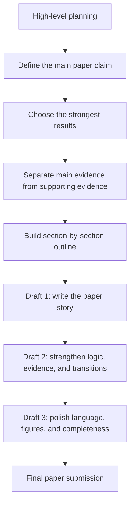
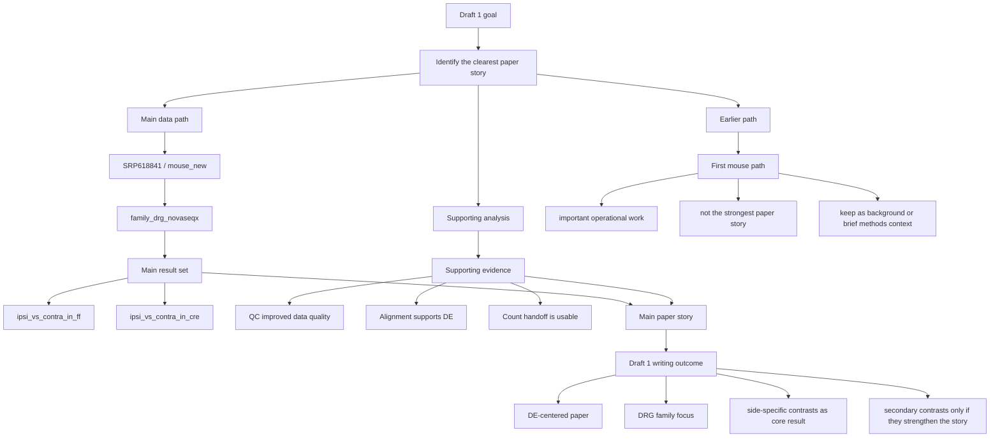

# Paper building strategy — shared team guide

## Recommendation

The current mind map is **useful**, but it should **not** be the main strategy for writing the paper.

Why:
- it captures the **history of the analysis work** well
- but a paper is not written as a history of everything that happened
- first-time writers usually need a structure based on:
  - the **main claim**
  - the **strongest evidence**
  - the **supporting evidence**
  - the **order of writing**

So the better strategy is:

> **use a story-first paper map**
>
> not just a project-history mind map

The old map can still be useful as a background planning artifact, but the drafting strategy should be built around the paper's argument.

---

## Core rule

We are not asking:

> "What happened first in the project?"

We are asking:

> "What is the clearest paper story supported by the best results?"

That change matters.

For this team, the paper should be organized around the **main biological result/story**, while older paths, QC, and processing steps stay in supporting roles unless they directly strengthen the claim.

---

## The strategy we should use

Use a **4-part paper-building strategy**:

1. **Paper claim**
   - decide the one main message of the paper
   - write it in 1 to 2 sentences

2. **Evidence ladder**
   - identify which results are central
   - separate main results from supporting results
   - keep only evidence that strengthens the paper story

3. **Section outline**
   - build the paper around the claim and evidence
   - every section should answer a clear question

4. **Draft sequence**
   - write results first
   - then figures/tables
   - then introduction and discussion
   - abstract last

This is easier for new writers because it tells them:
- what belongs in the paper
- what is background only
- what order to write in

---

## Diagram 1 — overall paper-building strategy

### Meaning

- **High-level planning** aligns the team
- the first real decision is the **main claim**
- then the team picks the **strongest evidence**
- then the paper is outlined around that evidence
- only after that does full drafting begin

This is better than the original version because it shows the real dependency:

**claim -> evidence -> outline -> drafts -> final paper**

instead of just listing drafts as separate boxes.

---

## Diagram 2 — Draft 1 story map

### Meaning

Draft 1 should do these things clearly:

- choose **one main data path**
- state the **main result set**
- keep **QC/alignment** as support, not the center of the paper
- treat the **first mouse path** as useful background work, not the main narrative

That means the paper story is driven by:
- **SRP618841 / mouse_new**
- **family_drg_novaseqx**
- the strongest **side-specific DE contrasts**

---

## What the team should write first

For a new writing team, Draft 1 should be built in this order:

### 1. One-sentence paper claim
Example template:

> This paper shows that the strongest and clearest signal in our dataset is the differential expression pattern in the DRG-related side-specific contrasts, with supporting QC and alignment evidence showing that the analysis path is technically usable and interpretable.

This sentence can be revised, but the team needs one central claim early.

### 2. Results skeleton
Create 3 to 5 result blocks only.

Suggested structure:
1. why this dataset/path became the main paper path
2. the main DRG family result
3. the strongest side-specific contrasts
4. supporting QC/alignment evidence
5. secondary results that help but do not distract

### 3. Figure plan
Before writing full prose, decide:
- Figure 1: study overview / workflow
- Figure 2: main DRG family result
- Figure 3: side-specific contrasts
- Figure 4: supporting QC/alignment evidence
- optional supplemental figure(s): secondary contrasts or earlier path details

### 4. Section owners
Assign who drafts each piece:
- results lead
- methods lead
- figure lead
- discussion lead
- editor/integrator

This matters a lot for inexperienced teams.

---

## What to keep from the original map

Keep these ideas from the original document:
- the team needs a shared high-level plan
- Draft 1 should lock the main story
- the first path still matters as real work
- `mouse_new` became the more usable main paper path
- QC and alignment support the paper but do not need to dominate it

Those are good decisions.

---

## What to change from the original map

Change these parts:

### 1. Do not make the map mainly about chronology
The current map partly reads like:
- first we tried this
- then it was weak
- then we moved here

That is useful internally, but papers are usually judged by:
- clarity of question
- strength of evidence
- coherence of argument

### 2. Make the central claim explicit
Right now the paper story is implied, not stated strongly enough.

The new version should make the main claim visible near the top of the strategy.

### 3. Make “main vs support” a formal rule
The original map says some things are support, but the structure does not enforce that strongly.

The new strategy should explicitly label:
- **main evidence**
- **supporting evidence**
- **background/history**

### 4. Show writing order
New teams often stall because they do not know what to draft first.

The strategy should show a direct writing sequence.

---

## Recommended team rule

Use this rule while drafting:

> If a result does not strengthen the main paper claim, it should be reduced, moved to support, or removed from the main narrative.

This will keep the paper focused.

---

## Bottom line

The original mind map is a **good background planning map**, but it is **not yet the best main drafting strategy** for a first-time paper-writing team.

The stronger approach is to use:

> **a story-first paper map built around claim -> evidence -> outline -> drafting**

That strategy is clearer, easier to teach, and more likely to produce a paper that reads like a real journal manuscript instead of a project timeline.
